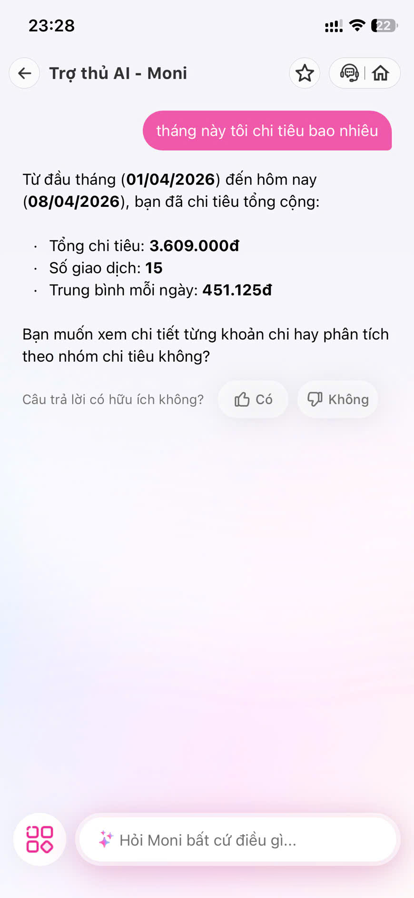
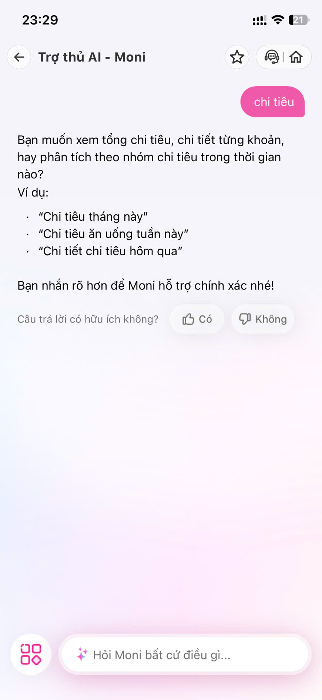
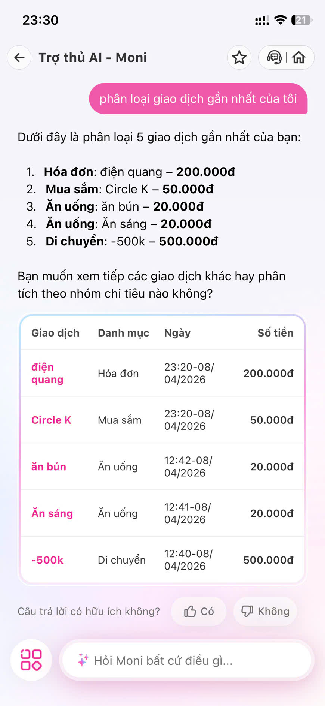
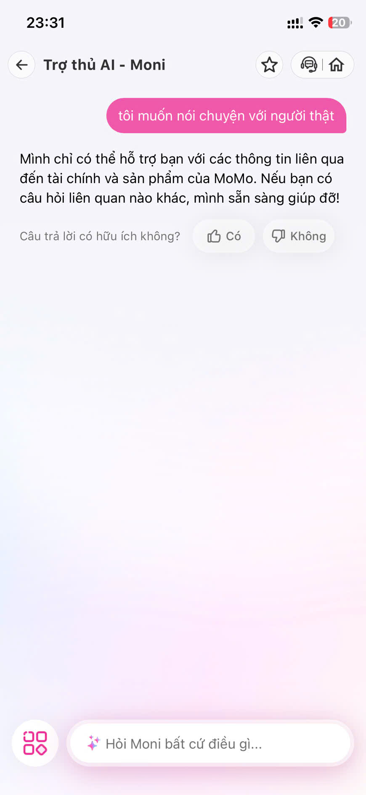

# Bài tập UX — MoMo: Trợ thủ AI Moni

## Sản phẩm: MoMo — Moni AI Assistant

**AI feature chính:** Phân loại chi tiêu tự động + Chatbot tài chính cá nhân

**Truy cập:** App MoMo → tab "Moni" (trợ thủ AI)

---

## Phần 1 — Khám phá sản phẩm

### Marketing hứa gì?

- **App Store & website MoMo:** "Moni — Trợ thủ tài chính AI giúp bạn quản lý chi tiêu thông minh, tự động phân loại giao dịch, phân tích xu hướng chi tiêu hàng tháng."
- **Bài PR:** Nhấn mạnh "không cần nhập tay", "AI tự hiểu bạn chi gì", "chat là xong — hỏi Moni bất cứ điều gì về tài chính."
- **Kỳ vọng được tạo ra:** AI chính xác, tự động hoàn toàn, sửa lỗi dễ dàng, trải nghiệm liền mạch như nói chuyện với trợ lý thật.

### Trải nghiệm thực tế khi dùng thử

- Mở app MoMo → vào tab Moni → giao diện chat, có các gợi ý nhanh ("Chi tiêu tuần này", "So sánh tháng trước").
- **AI phản ứng:** Trả lời nhanh (~2-3 giây), kèm biểu đồ tròn phân loại chi tiêu, danh sách giao dịch theo category.
- **UI thay đổi:** Xuất hiện nút "Chính xác" / "Gửi phản hồi" dưới mỗi câu trả lời. Có 3-4 nút gợi ý nhanh (quick replies) sau mỗi câu trả lời.
- **Nhận xét:** Giao diện đẹp, phản hồi nhanh. Tuy nhiên khi đi sâu vào edge cases, bắt đầu thấy vấn đề.

---

## Phần 2 — Phân tích 4 Paths

### Path 1: Khi AI đúng

**Câu hỏi gửi Moni:** `"Tháng này tôi chi tiêu bao nhiêu?"`



**Kết quả:** Moni trả lời nhanh, rõ ràng:
- Xác định đúng khoảng thời gian: từ đầu tháng (01/04/2026) đến hôm nay (08/04/2026)
- Hiện 3 chỉ số: **Tổng chi tiêu 3.609.000đ** · Số giao dịch **15** · Trung bình mỗi ngày **451.125đ**
- Hỏi tiếp: *"Bạn muốn xem chi tiết từng khoản chi hay phân tích theo nhóm chi tiêu không?"*
- Có nút feedback: "Câu trả lời có hữu ích không?" → **Có / Không**

**Phân tích:**

| Câu hỏi | Nhận xét |
|----------|----------|
| **User thấy gì?** | Tổng chi tiêu + số giao dịch + trung bình/ngày — đủ thông tin, trình bày gọn gàng dạng bullet points. |
| **Hệ thống confirm thế nào?** | Có 2 cơ chế: (1) nút **Có/Không** để user xác nhận câu trả lời hữu ích, (2) gợi ý câu hỏi tiếp theo để đào sâu. |
| **Đánh giá** | **Tốt.** Value moment rõ ràng — user hỏi 1 câu, nhận đủ data cần thiết. Flow mượt mà, có cơ chế confirm + gợi ý follow-up. |

---

### Path 2: Khi AI không chắc

**Câu hỏi gửi Moni:** `"Chi tiêu"`



**Kết quả:** Moni **không đoán bừa**, mà chủ động hỏi lại:
- *"Bạn muốn xem tổng chi tiêu, chi tiết từng khoản, hay phân tích theo nhóm chi tiêu trong thời gian nào?"*
- Gợi ý 3 ví dụ cụ thể: "Chi tiêu tháng này" · "Chi tiêu ăn uống tuần này" · "Chi tiết chi tiêu hôm qua"
- Kết thúc bằng: *"Bạn nhắn rõ hơn để Moni hỗ trợ chính xác nhé!"*
- Vẫn có nút feedback **Có/Không**

**Phân tích:**

| Câu hỏi | Nhận xét |
|----------|----------|
| **Hệ thống xử lý thế nào?** | **Hỏi lại + show alternatives.** Moni nhận ra câu hỏi mơ hồ, không trả lời bừa mà clarify bằng 3 ví dụ cụ thể. |
| **Im lặng? Hỏi lại? Show alternatives?** | Hỏi lại + show 3 alternatives rõ ràng. Không im lặng, không đoán. Giọng văn thân thiện, không khiến user cảm thấy bị trách. |
| **Đánh giá** | **Path tốt nhất.** Đây là augmentation UX rất tốt: AI thừa nhận không chắc → gợi ý → user quyết. Tránh sai lầm, giữ trust. |

---

### Path 3: Khi AI sai

**Câu hỏi gửi Moni:** `"Phân loại giao dịch gần nhất của tôi"`



**Kết quả:** Moni hiện bảng 5 giao dịch gần nhất với phân loại:

| Giao dịch | Danh mục Moni gán | Đúng/Sai? |
|-----------|-------------------|-----------|
| điện quang — 200.000đ | Hóa đơn | Đúng |
| Circle K — 50.000đ | **Mua sắm** | **Sai** — Circle K là cửa hàng tiện lợi, mua đồ ăn/uống → nên là "Ăn uống" |
| ăn bún — 20.000đ | Ăn uống | Đúng |
| Ăn sáng — 20.000đ | Ăn uống | Đúng |
| -500k — 500.000đ | Di chuyển | Không rõ — tên giao dịch chỉ là "-500k", không có context để verify |

**Phân tích:**

| Câu hỏi | Nhận xét |
|----------|----------|
| **User biết sai bằng cách nào?** | User tự phát hiện khi nhìn bảng — thấy "Circle K" gán "Mua sắm" thay vì "Ăn uống". **Không có cơ chế AI chủ động cảnh báo** giao dịch nào confidence thấp. |
| **Sửa bằng cách nào?** | **Không sửa được trong chat.** Moni chỉ hiện bảng read-only. Muốn sửa phải thoát chat → vào Sổ giao dịch → tìm giao dịch → sửa danh mục → lưu. |
| **Bao nhiêu bước?** | **4-5 bước, rời khỏi context chat hoàn toàn.** |
| **AI có học từ correction?** | Không rõ. Không có feedback nào báo "Đã ghi nhận". User không biết việc sửa có ý nghĩa gì. |
| **Đánh giá** | **PATH YẾU NHẤT.** Circle K bị tag sai là ví dụ điển hình — AI không hiểu context (cửa hàng tiện lợi = ăn uống). Recovery flow phá vỡ trải nghiệm, thiếu inline correction, thiếu feedback loop. |

---

### Path 4: Khi user mất niềm tin

**Câu hỏi gửi Moni:** `"Tôi muốn nói chuyện với người thật"`



**Kết quả:** Moni trả lời:
- *"Mình chỉ có thể hỗ trợ bạn với các thông tin liên quan đến tài chính và sản phẩm của MoMo. Nếu bạn có câu hỏi liên quan nào khác, mình sẵn sàng giúp đỡ!"*
- **Không chuyển sang CSKH.** Không đưa link/nút liên hệ người thật. Không gợi ý cách thoát.
- Vẫn chỉ có nút **Có/Không** cho feedback.

**Phân tích:**

| Câu hỏi | Nhận xét |
|----------|----------|
| **Có exit không?** | Chỉ có nút back (←) ở góc trái để thoát. Không có nút "Kết thúc chat" hay "Quay về trang chính" rõ ràng. |
| **Có fallback (con người, manual)?** | **Không.** Moni từ chối khéo và redirect về chính mình. Không đưa link CSKH, không gợi ý hotline, không có nút "Nói chuyện với nhân viên". |
| **Dễ tìm không?** | **Rất khó.** User phải tự biết thoát chat, tự tìm mục "Hỗ trợ" ở nơi khác trong app. Không liền mạch. |
| **Đánh giá** | **Yếu.** Khi user mất niềm tin và muốn escalate → bị chặn lại, không có lối thoát. Đây là anti-pattern trong AI UX: thiếu opt-out / human fallback. |

---

### Tóm tắt phân tích

| Path | Đánh giá | Bằng chứng từ test thực tế |
|------|----------|---------------------------|
| 1. AI đúng | Tốt | Trả lời nhanh, đúng, có 3 chỉ số + nút feedback + gợi ý follow-up |
| 2. AI không chắc | **Tốt nhất** | Hỏi lại với 3 ví dụ cụ thể, không đoán bừa, giọng thân thiện |
| 3. AI sai | **Yếu nhất** | Circle K bị tag "Mua sắm" thay vì "Ăn uống". Không sửa được trong chat, 4-5 bước recovery |
| 4. User mất tin | Yếu | Moni từ chối chuyển CSKH, không exit/fallback, user bị "nhốt" trong loop AI |

**Path yếu nhất: Path 3 + Path 4** — Khi AI sai, không có cách sửa nhanh. Khi user muốn thoát, không có đường ra. Hai path này kết hợp tạo vòng xoáy mất niềm tin: sai → muốn escalate → bị chặn → càng mất tin.

---

## Phần 3 — Gap giữa marketing và thực tế

### So sánh

| Khía cạnh | Marketing hứa | Thực tế (test 08/04/2026) |
|-----------|---------------|--------------------------|
| Phân loại chi tiêu | "Tự động phân loại thông minh" | Trong 5 giao dịch test: **1 sai rõ** (Circle K → "Mua sắm" thay vì "Ăn uống"), **1 không rõ** (-500k → "Di chuyển" nhưng không đủ context). Tỷ lệ đúng ~60-80%. |
| Sửa lỗi | "AI học từ bạn" | Không sửa được trong chat Moni. Phải thoát → vào Sổ giao dịch → 4-5 bước. Không có thông báo AI đã học từ correction. |
| Trợ thủ tài chính | "Chat là xong — hỏi Moni bất cứ điều gì" | Chat chỉ hiện dữ liệu read-only. Không sửa, không thao tác. Hỏi "nói chuyện với người thật" → bị từ chối, không chuyển CSKH. |
| Trải nghiệm tổng thể | "Liền mạch, thông minh" | Liền mạch khi AI đúng (Path 1, 2). Khi sai hoặc mất tin (Path 3, 4) → rời rạc, bế tắc, không có lối thoát. |

### Gap lớn nhất

> **Marketing hứa "trợ thủ thông minh, chat là xong" — thực tế Moni chỉ là dashboard dạng chat, không có khả năng sửa lỗi hay escalate.**

Cụ thể 2 gap nghiêm trọng:
1. **Gap phân loại:** Circle K (mua đồ ăn/uống) bị tag "Mua sắm" — AI không hiểu context cửa hàng tiện lợi. Marketing không đặt kỳ vọng rằng AI có thể sai.
2. **Gap hỗ trợ:** User muốn nói chuyện người thật → Moni từ chối, không đưa fallback. Marketing gọi là "trợ thủ" nhưng thực tế không có khả năng chuyển sang trợ thủ thật khi cần.

---

## Phần 4 — Sketch cải thiện (Path 3: Khi AI sai)

### As-is (hiện tại) — User journey khi AI tag sai

```
User mở Moni chat
 → Hỏi "Phân loại giao dịch gần nhất"
 → Moni hiện bảng 5 giao dịch (read-only)
 → User thấy Circle K 50.000đ bị tag "Mua sắm" (sai — đây là ăn uống)
 → BREAKING POINT: Bảng chỉ đọc, không bấm sửa được
 → User phải thoát chat Moni (nút ←)
 → Tự tìm "Sổ giao dịch" trong app
 → Tìm giao dịch Circle K trong danh sách
 → Bấm vào → Sửa danh mục → Chọn "Ăn uống" → Lưu
 → Quay lại Moni → Hỏi lại để verify
 → (Không biết AI có học từ correction không)
```

**Vấn đề chính:**
- Bảng giao dịch trong chat là **read-only** — không bấm sửa được
- 4-5 bước thủ công, thoát khỏi context chat hoàn toàn
- Không có confidence indicator (giao dịch nào AI không chắc)
- Không có feedback loop (user sửa → AI học)
- Khi muốn escalate ("nói chuyện người thật") → bị từ chối

### To-be (đề xuất) — User journey cải thiện

```
User mở Moni chat
 → Hỏi "Phân loại giao dịch gần nhất"
 → Moni hiện bảng 5 giao dịch — NHƯNG bấm được
 → Circle K hiện tag nhạt "Mua sắm?" + icon (AI không chắc)
 → User bấm vào tag "Mua sắm?" trực tiếp trong bảng
 → Pop-up nhỏ: "Ăn uống" · "Mua sắm" · "Khác..."
 → User chọn "Ăn uống" (1 chạm)
 → Bảng cập nhật tức thì + Moni nói: "Đã ghi nhận! Lần sau sẽ chính xác hơn"
 → Nếu user vẫn không tin → nút "Nói chuyện với nhân viên MoMo" ngay trong chat
 → (AI ghi nhận correction → cải thiện model cho user này)
```

**Thay đổi chính:**

| Thay đổi | Mô tả |
|----------|-------|
| **Thêm:** Inline correction | Bấm trực tiếp vào tag → pop-up chọn lại category ngay trong chat |
| **Thêm:** Confidence indicator | Giao dịch low-confidence hiện tag nhạt + icon "?" để user biết AI không chắc |
| **Thêm:** Feedback confirmation | Sau khi user sửa, hiện "Đã ghi nhận, lần sau chính xác hơn" — tạo trust |
| **Thêm:** Real-time update | Biểu đồ tự cập nhật ngay sau correction — user thấy impact |
| **Bớt:** Context switching | Không cần thoát chat → vào Sổ giao dịch → quay lại |
| **Đổi:** Recovery từ 4-5 bước → 2 bước | Bấm tag → chọn category → xong |
| **Thêm:** Human fallback | Nút "Nói chuyện với nhân viên MoMo" ngay trong chat — thay vì từ chối như hiện tại |

### Lợi ích

- **Giảm friction:** 4-5 bước → 2 bước chạm (VD: sửa Circle K từ "Mua sắm" → "Ăn uống" ngay trong chat)
- **Tăng trust:** User thấy AI thừa nhận không chắc + học từ correction
- **Tạo feedback loop:** Mỗi correction = training signal → AI ngày càng chính xác cho user đó
- **Có lối thoát:** Khi user mất niềm tin → có nút escalate sang người thật, không bị "nhốt" trong loop AI

---

## Sketch

> Ảnh đính kèm: `sketch.jpg`

Sketch mô tả 2 luồng song song:
- **Bên trái (As-is):** Luồng hiện tại với breaking point tại "thoát chat để sửa"
- **Bên phải (To-be):** Luồng cải thiện với inline correction, confidence indicator, feedback confirmation

---

*Bài tập UX — Ngày 5 — VinUni A20 — AI Thực Chiến · 2026*
